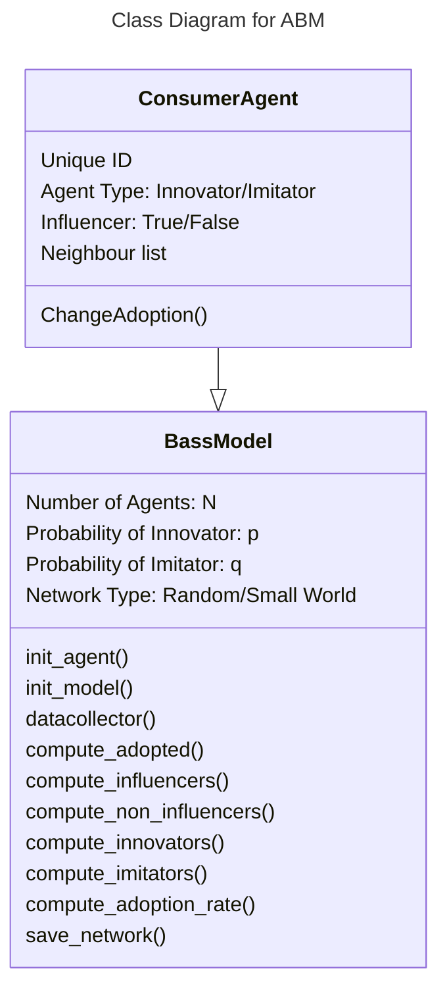
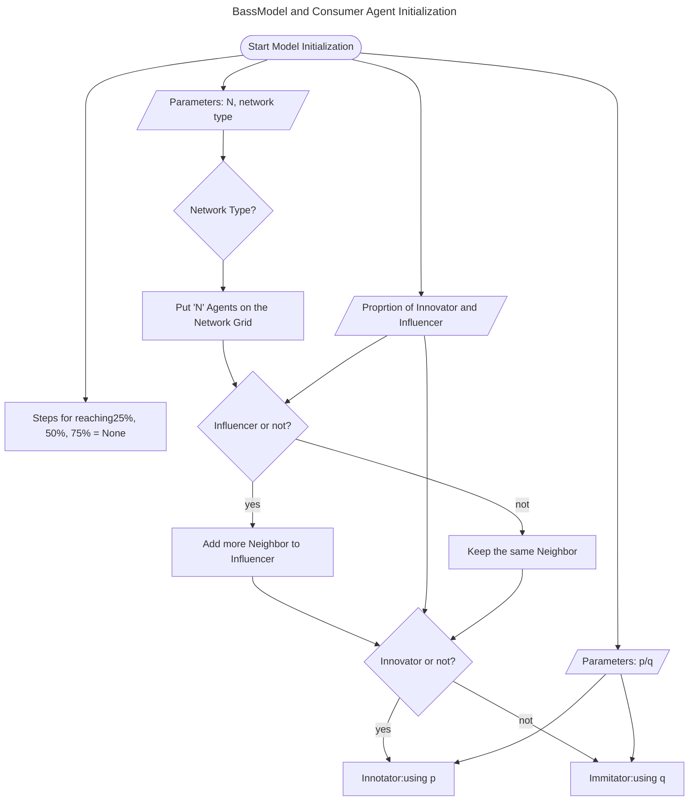

# ABM Research for Marketing Diffusion
[Environment Configuration](../README.md)

```mermaid
---
title: Class Diagram for ABM
---
classDiagram

    class ConsumerAgent{
        Unique ID
        Agent Type: Innovator/Imitator
        Influencer: True/False
        Neighbour list
        ChangeAdoption()
    }

    ConsumerAgent --|> BassModel

    class BassModel{
        Number of Agents: N
        Probability of Innovator: p
        Probability of Imitator: q
        Network Type: Random/Small World
        init_agent()
        init_model()
        datacollector()
        compute_adopted()
        compute_influencers()
        compute_non_influencers()
        compute_innovators()
        compute_imitators()
        compute_adoption_rate()
        save_network()
    }

```

```mermaid
---
title: BassModel and Consumer Agent Initialization
---
flowchart TD
    start([Start Model Initialization])
    start --> ModelAttr[/Parameters: N, network type/]
    start --> agentAttr[/Parameters: p/q/]
    start --> inputProp[/Proprtion of Innovator and Influencer/]
    start -----> AdoptionPerc[Steps for reaching25%, 50%, 75% = None]
    ModelAttr --> Net{Network Type?} --> pos[Put 'N' Agents on the Network Grid]
    pos --> inf{Influencer or not?}
    inputProp --> inf
    inf --yes--> Add[Add more Neighbor to Influencer]
    inf --not--> Keep[Keep the same Neighbor]
    Add --> innoimit{Innovator or not?}
    inputProp --> innoimit
    Keep --> innoimit
    innoimit --yes--> Innotator[Innotator:using p]
    innoimit --not--> Immitator[Immitator:using q]
    agentAttr --> Innotator
    agentAttr --> Immitator
```